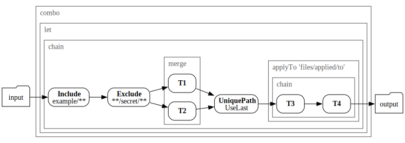

# Combo transform

This topic tells you about the Application Accelerator `Combo` transform in Tanzu Application Platform (commonly known as TAP).

The `Combo` transform combines the behaviors of [Include](include.md), [Exclude](exclude.md),
[Merge](merge.md), [Chain](chain.md), [UniquePath](unique-path.md), and [Let](let.md).



## <a id="syntax-referance"></a>Syntax reference

Here is the full syntax of `Combo`:

```yaml
type: Combo                  # This can be omitted, because Combo is the default transform type.
let:                        # See Let.
  - name: <string>
    expression: <SpEL expression>
  - name: <string>
    expression: <SpEL expression>
condition: <SpEL expression>
include: [<ant pattern>]    # See Include.
exclude: [<ant pattern>]    # See Exclude.
merge:                      # See Merge.
  - <m1-transform>
  - <m2-transform>
  - ...
chain:                     # See Chain.
  - <c1-transform>
  - <c2-transform>
  - ...
applyTo: [<ant pattern>]   # See Chain
onConflict: <conflict resolution> # See UniquePath.
```

## <a id="behavior"></a>Behavior

The `Combo` transform  properties have default values, are optional, and you must use at least one property.

When you configure the `Combo` transform with all properties, it behaves as follows:

1. Applies the `include` as if it were the first element of a [Chain](chain.md).
   The default value is `['**']`; if not present, all files are retained.

2. Applies the `exclude` as if it were the second element of the chain. The default value is `[]`;
   if not present, no files are excluded. Only files that match the `include`, but are not excluded
   by the `exclude`, remain.

3. Feeds all those files as input to all transforms declared in the `merge` property, exactly as
   [Merge](merge.md) does. The result of that `Merge`, which is the third transform in the big
   chain, is another set of files. If there are no elements in `merge`, the previous result is
   directly fed to the next step.

4. The result of the merge step is prone to generate duplicate entries for the same `path`.
   It's implicitly forwarded to a [UniquePath](unique-path.md) check, configured
   with the `onConflict` [strategy](conflict-resolution.md). The default policy is to retain
   files appearing later. The results of the transforms that appear later in the `merge`
   block "win" against results appearing earlier.

5. Passes that result as the input to the [chain](chain.md) defined by the `chain` property.
   The combo chain is prolonged with the elements defined in `chain`.
   If there are no elements in `chain`, it's as if the previous result was used directly.
   If the `applyTo` property is set, it applies to the sub-chain (and that sub-chain only).

6. If the `let` property is defined in the `Combo`, the whole execution
   is wrapped inside a [Let](let.md) that exposes its derived symbols.

To recap in pseudo code, a giant `Combo` behaves like this:

``` console
Let(symbols, in:
    Chain(
        include,
        exclude,
        Chain(Merge(<m1-transform>, <m2-transform>, ...), UniquePath(onConflict)),
        Chain(<applyTo>, <c1-transform>, <c2-transform>, ...)
    )
)
```

You rarely use at any one time all the features that `Combo` offers.
Yet `Combo` is a good way to author other common building blocks
without having to write their `type: x` in full.

For example, this:

```yaml
include: ['**/*.txt']
```

is a perfectly valid way to achieve the same effect as this:

```yaml
type: Include
patterns: ['**/*.txt']
```

Similarly, this:

```yaml
chain:
  - type: T1
    ...
  - type: T2
    ...
```

is often preferred over the more verbose:

```yaml
type: Chain
transformations:
  - type: T1
    ...
  - type: T2
    ...
```

As with other transforms, the order of declaration of properties has no impact. For clarity,
a convention that mimics the actual behavior is used, but the following applies **T1** and **T2**
on all `.yaml` files even though it places the `include` section after the `merge` section.

```yaml
merge:
  - type: T1
  - type: T2
include: ["*.yaml"]
```

In other words, `Combo` applies `include` filters before `merge` irrespective of the physical order
of the keys in the YAML text. It's a good practice to place the `include` key before the
`merge` key. This makes the accelerator definition more readable, but has no effect on its execution
order.

## <a id="examples"></a>Examples

The following are typical use cases for `Combo`.

### <a id="example1"></a>Example 1

To apply separate transformations to separate sets of files. For example, to all `.yaml` files
and to all `.xml` files:

```yaml
merge:                   # This uses the Merge syntax in a first Combo.
  - include: ['*.yaml']      # This actually nests a second Combo inside the first.
    chain:
      - type: T1
      - type: T2
  - include: ['*.xml']      # Here comes a third Combo, used as the 2nd child inside the first
    chain:
      - type: T3
      - type: T4
```


### <a id="example2"></a>Example 2

To apply **T1** then **T2** on all `.yaml` files that are not in any `secret` directory:

```yaml
include: ['**/*.yaml']
exclude: ['**/secret/**']
chain:
  - type: T1
    ..
  - type: T2
    ..
```


